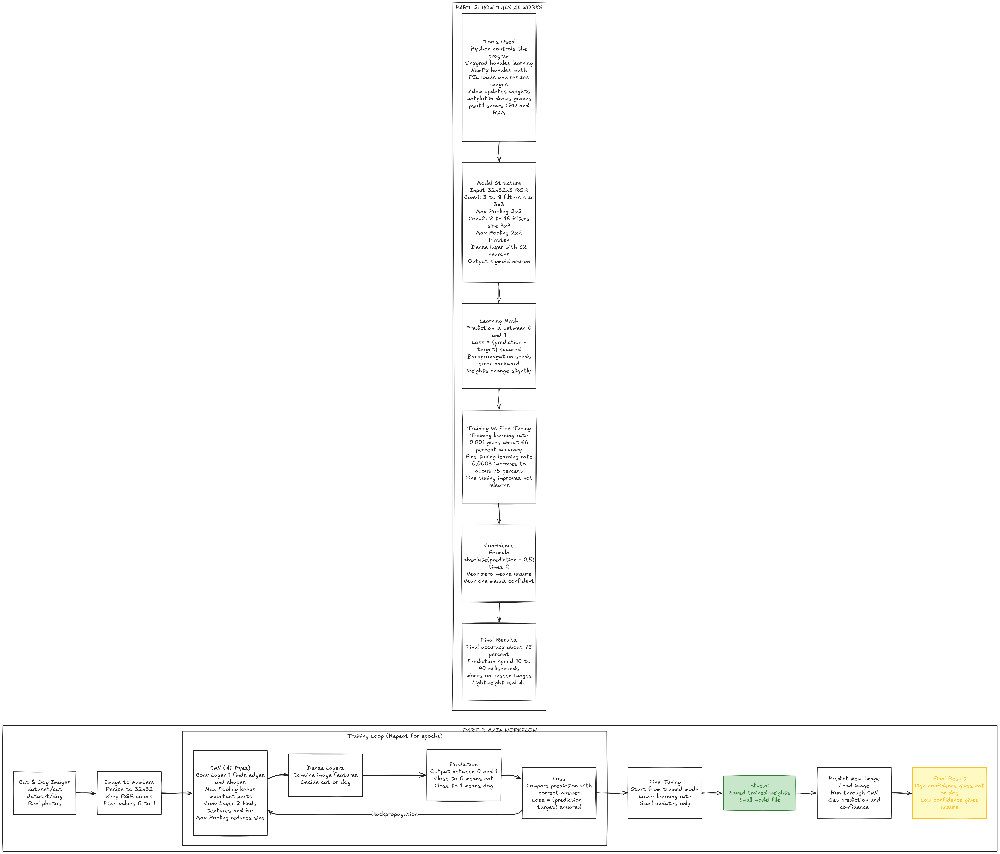
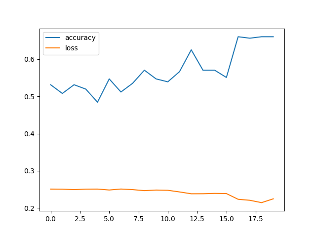
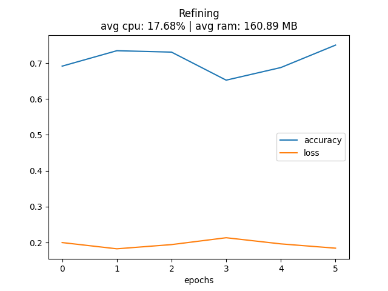
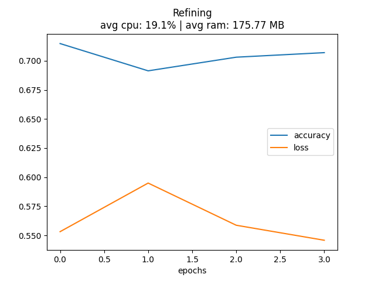

# Olive
Olive is an open sourced, extremely lightweight, CNN based image detection neural network AI model which identifies if the image is a cat or a dog.

# Example

- it got 9/10 images correctly

# About olive

- 0.0-0.25 low confidence
- 0.25-0.55 moderate confidence
- 0.55-0.75 highly confident

# After training olive

# After first fine tuning

# After second fine tuning

# feel free to modify or use this project (or curse me for writing code with almost no debugging)

# Fun Fact
This entire project was made with $0 budget by solo dev (me, blaze) using a smartphone on weekend just because I had nothing to do
